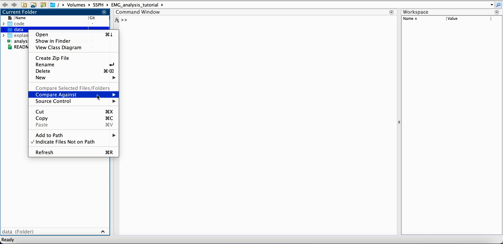
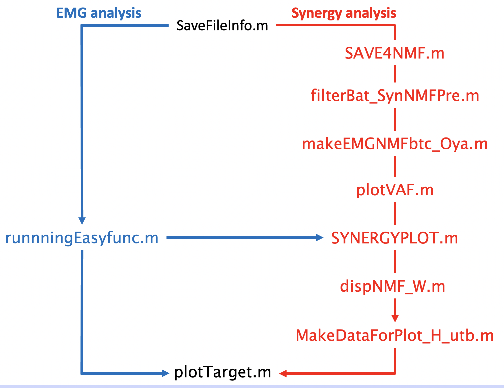

## Overview
This repository provides codes and files for muscle synergy and EMG analysis tutorials.<br>
(This repository has eliminated some features for simplicity. If you want to use all features, please refer to [this repository](https://github.com/nihotoa/EMG_analysis_latest))

***

## How to Analyze

  - <span style="font-size: 18px;">**Preliminary Preparations**</span>

    - Please place all recorded data file directly under the monkey name folder.

      (ex.) EMG_analysis_turorial/data/Yachimun/

      - (To obtain the dataset, <strong>please contact the email address given in the contact section.</strong>)

    <!-- insert image -->
    

    - Please understand the directory structure of this repository

      The documentation in each code assumes that you understand this folder structure.<br>
      The Schematic diagram of this folder structure is shown in the following figure. (This folder structure is tentative version. It may change in future updates)

      ```
      EMG_analysis_tutorial
        │
        ├ README.md
        │
        ├ analysis_data_days(Yachimun).csv
        │
        ├ code
        │　├ filterBat_SynNMFPre.m
        │　├ makeEMGNMFbtc_Oya.m
        │　├ (other function files)
        │　│
        │　├ VBSR
        │　│　└ (some function files)
        │　│ 　　
        │　├ codeForPlotTarget　
        │　│　└ (some function files)
        │　│
        │　└ ttb
        │　　 └ (some function files)
        │
        ├ data
        │　├ runnningEasyfunc.m
        │　├ plotTarget.m
        │　├ SAVE4NMF.m
        │　│
        │　└ Yachimun
        │      ├ SaveFileinfo.m
        │      ├ SYNERGYPLOT.m
        │      ├ (other function files)
        │　 　　│
        │      └ new_nmf_result
        │      　　├ dispNMF_W.m
        │      　　├ plotVAF.m
        │      　　└ MakeDataForPlot_H_utb.m
        │
        └ explanation_materials
        　　└  (some images)

      ```

    - Please add 'code' and 'data' folder to PATH in MATLAB

    <!-- insert image -->
    

  - <span style="font-size: 18px;">**Sequence of Analysis**</span>

  The sequence of EMG analysis and muscle synergy analysis is shown in the figure below.<br>
  For details on the usage and processing of each code, please refer to the description at the beginning of code.

  <!-- insert image -->
  

***

## Remarks
  The following information is written at the beginning of each code. Please refer to them and proceed with the analysis.
  - **Your operation**<br>
    This describes what you need to do to perform each function.

  - **Role of this code**<br>
    Details of the role each function plays in the overall analysis.

  - **Saved data location**<br>
    Details of the data saved when each function is executed and the location of this

  - **Procedure**<br>
    This describes which code should be executed before and after this code.

***

## Other information

  - If all datasets are processed, the total size of the output data and figures will be about 100GB. Therefore, please make sure that you have enough storage on your device before you start analysis

  - The dates adopted as experimental dates are summarized in 'analysis_data_days(Yachimun).csv'. This file is located at the top level of this repository.

  - Details of the experiment and analysis outline are distributed separately. If you would like to get these information, <strong>please contact at the email address given in the contact section</strong>

***

## Contact

  If you want to get the dataset for analysis or have any questions, please feel free to contact me at nao-ota@ncnp.go.jp
